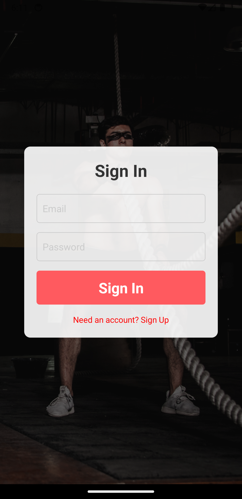
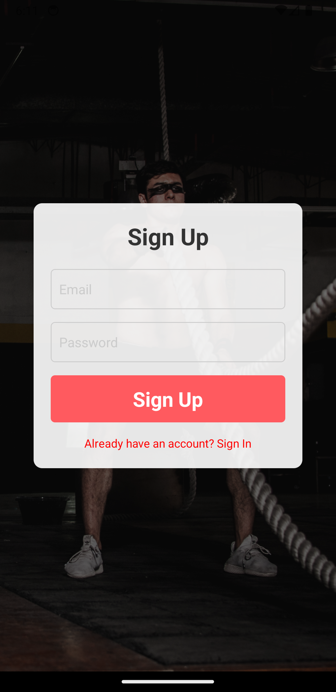
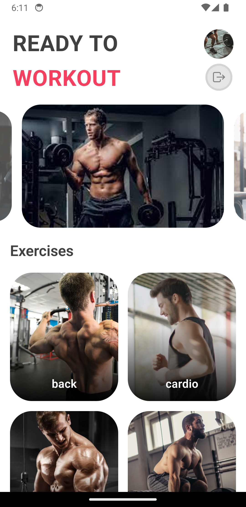
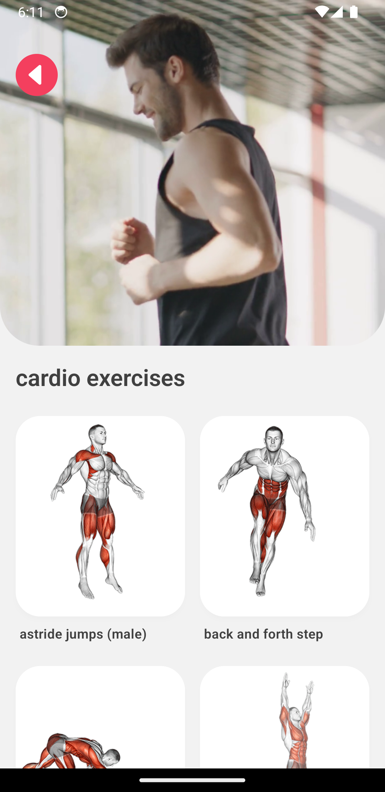
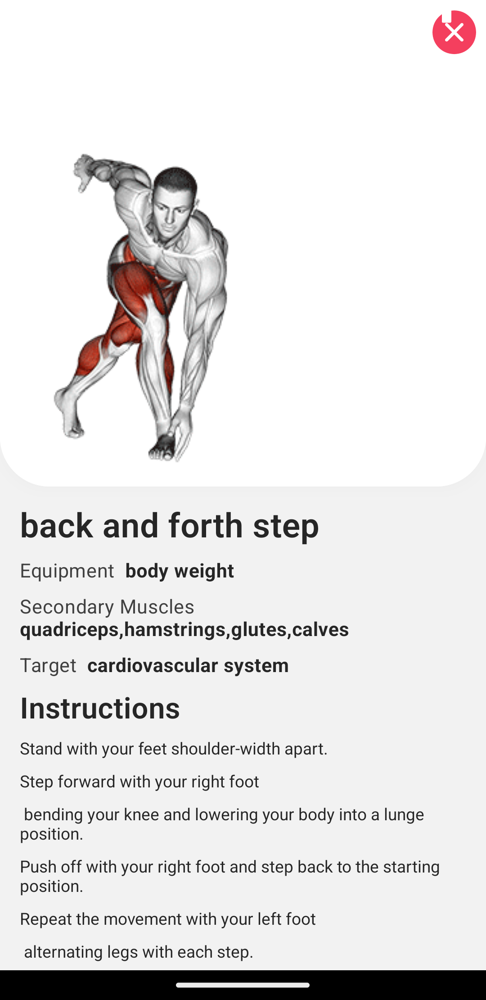

# Fitness App

Welcome to  Fapp This app is designed to help you stay fit and healthy by providing a variety of exercises you can perform, all categorized by body parts for your convenience. Built using React Native and Firebase, this app ensures a smooth and efficient user experience.

## Features

- **User Authentication:** Sign up and sign in with ease using Firebase Authentication.
- **Exercise Categories:** Browse exercises categorized by different body parts.
- **Detailed Exercise Instructions:** Get comprehensive instructions for each exercise, including the muscles targeted and the equipment required.
- **Responsive Design:** Enjoy a seamless experience on different screen sizes, thanks to `react-native-responsive-screen`.

## Screenshots

### Sign Up Screen

### Sign In Screen

### Home Screen

### Exercise Categories

### Exercise Details

## How to Use

- **Sign Up:** Create an account with your email and password.
- **Sign In:** Log in using your registered email and password.
- **Browse Exercises:** Explore exercises organized by body parts.
- **View Exercise Details:** Click on an exercise to see detailed instructions, including which muscles it targets and what equipment you need.

## Code Structure

Here's a quick overview of the main files in the project:

- `index.jsx`: The entry point of the app, handling user authentication.
- `home.jsx`: The home screen, which welcomes users and displays exercise categories.
- `exercises.jsx`: This screen shows a list of exercises for a selected body part.
- `exerciseDetails.jsx`: Here, users can find detailed instructions for a chosen exercise.
- `components/ImageSlider.jsx`: A component for displaying an image slider.
- `components/BodyParts.jsx`: A component that lists different body parts.

## Contributions

I'd love your help to make this app better! Feel free to fork the repo and make a pull request with your improvements.

---

Thanks for checking out the Fitness App! I hope it helps you on your fitness journey. If you have any questions or feedback, feel free to reach out.
